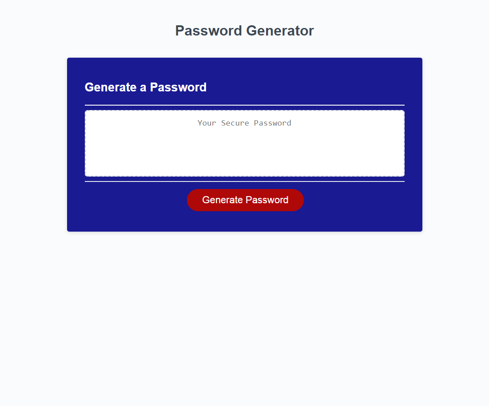
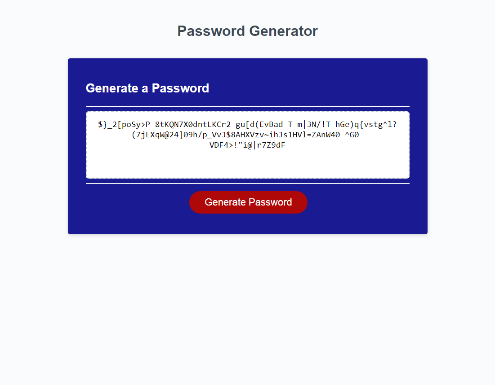
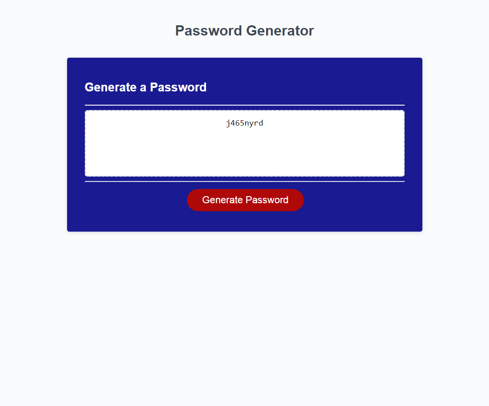

# passwordGenerator

#### By John Toth

## Description

This project demonstrates utilizing Javascript to build a password generator.  The application queries the user for the password length between 8 and 128 characters.  Input validation is performed to make sure an integer between those values is entered by user before continuing.  The user is then queried for which types of character types they would like to include in the password.  User is required to select at least 1 of the 4 types.  The password can contain upper case characters, lower case characters, numbers or special characters.

Once all the required user inputs are completed and validated, the application then proceeds to randomly select characters from the types selected by the user to build the password string.   Once the password string reaches the specified length it is written back to the webpage.

## Screenshot

The following is a picture of the application before any user entries.

  

The following is a picture of the application after generating a 128 character password utilizing all 4 characters types.

  

The following is a picture of the application after generating an 8 character password only utilizing lower case and number characters.

  

## Setup/Installation Requirements

Direct link to repository:  https://github.com/jtoth7824/passwordGenerator

Direct link to Code Refactor webpage:  https://jtoth7824.github.io/passwordGenerator/

## Support and contact details

Please email me for further questions at jtoth7824@gmail.com

## Technologies Used

Javascript
HTML
CSS